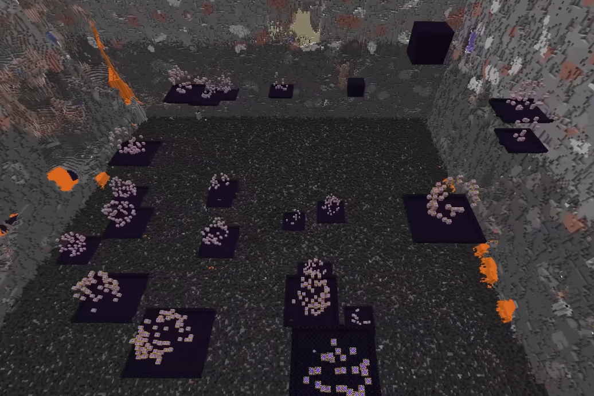
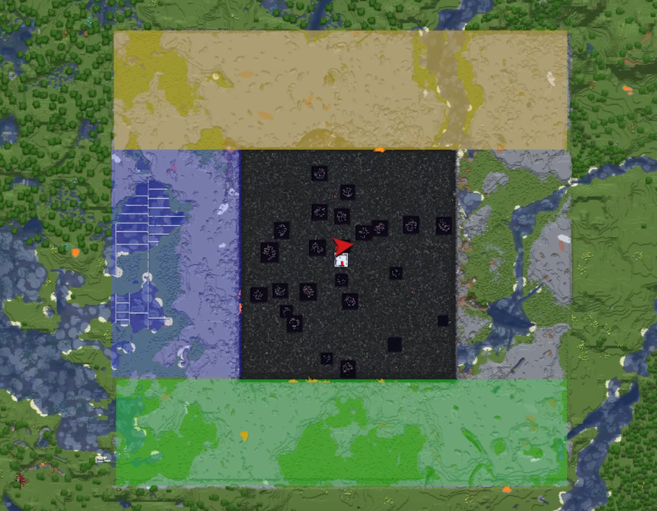
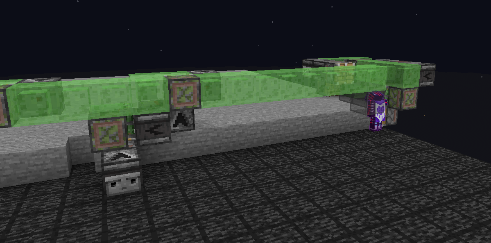
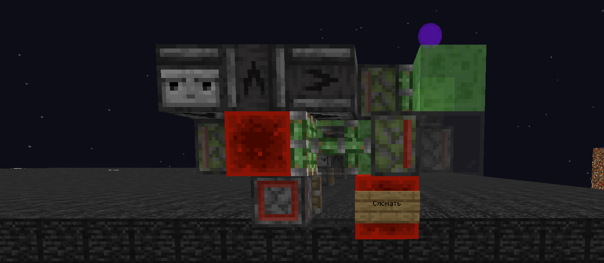
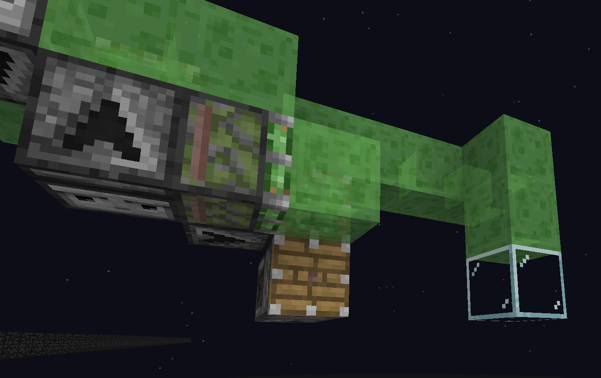
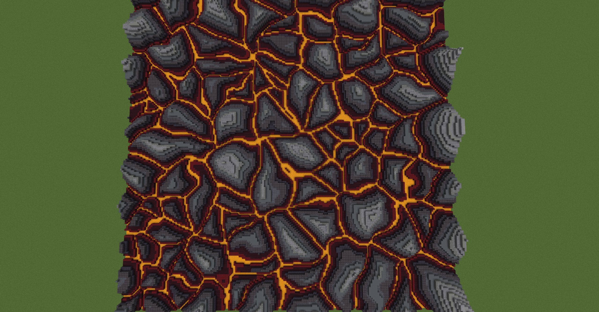
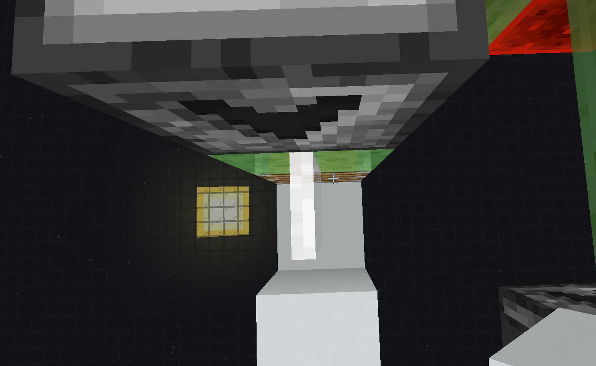
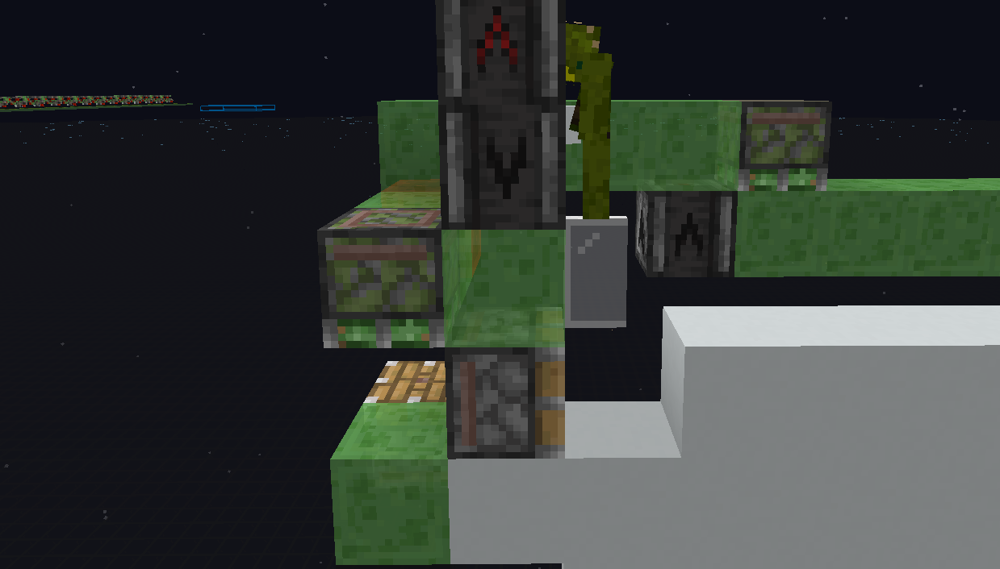

# **Ферма аметистов - разбор видео**
Все ссылки на скачивание механизмов внизу страницы

----
## **[1:20-2:00](https://youtu.be/YXl0l1Z1U3A?si=aytfZwuLKPcN2USU&t=79){:target="_blank"} - Создание [периметра](/Pages/Perimeters/perimeters.html)**
**Для создания мериметра для фермы были использованы инструменты из [статьи про периметры](/Pages/Perimeters/perimeters.html)**

Для сохранения аметистовых геод центральная часть была выкопана при помощи [3-way дюперов](/Pages/Perimeters/perimeters.html#ссылки-на-скачивание)
**Геоды были окружены обсидиановыми коробками и водой.**

Окружающее пространство было выкопано при помощи четырех [World Eater](/Pages/Perimeters/perimeters.html#--world-eater)'ов

----
## **[2:52](https://youtu.be/YXl0l1Z1U3A?si=aytfZwuLKPcN2USU&t=172){:target="_blank"} - мод [Geodesy](https://modrinth.com/mod/geodesy)**
**Тут уж используйте оффициальные гайды с [Modrinth](https://modrinth.com/mod/geodesy)**

----
## **[3:30-3:37](https://youtu.be/YXl0l1Z1U3A?si=aytfZwuLKPcN2USU&t=210){:target="_blank"} - Механизм для установки пола**

**Для этого был использован механизм [Floor Placer](/Pages/Amethyst/amethyst.html#ссылки-на-скачивание) и [шедоу - предметы](https://www.youtube.com/watch?v=DPxTUuADxac){:target="_blank"} передававшие в инвентарь игроку блоки для установки**

**Это позволило обойтись без систем подачи предметов**

### **Подобные механизмы обычно включаются/выключаются ломанием и установкой редстоун блока, разберитесь как оно работат перед постройкой**

Для удлиннения механизма процесс похож на [Периметры](/Pages/Perimeters/perimeters.html#как-изменить-размер-world-eater), только вам необходимо удлиннить центр, а концы оставить

В некоторых случаях в конце будет "Стоппер" - ограничивающий длину выходящего потока блоков. Такой можно сделать и самим

**Без стоппера блоки прекратят движение через 11 блоков от последней машинки**

----
## **[4:00](https://youtu.be/YXl0l1Z1U3A?si=aytfZwuLKPcN2USU&t=240){:target="_blank"} - Генерация стены**

Команды от [imhols](https://x.com/imhols1){:target="_blank"}
### **КОМАНДА СРАБОТАЕТ ТОЛЬКО В ГОРИЗОНТАЛЬНОМ ПОЛОЖЕНИИ**
Первая команда:

    //calc n=1000;for(i=0,255)for(j=0;j<255*3;j+=3){k=i*255+j;if(k>n*3)break;gmegabuf(k,2*random()-1);gmegabuf(k+1,0);gmegabuf(k+2,2*random()-1)}1
    
Вторая команда:

    //g 251 n=100;d=0;p=(perlin(1,x,1,z,5,2,0.3)-.5)*0.1;x+=p;z+=p;i=gclosest(x,y,z,0,n,3);do{d+=0.01;i1=gclosest(x+d,y,z,0,n,3)i2=gclosest(x-d,y,z,0,n,3)i3=gclosest(x,y,z+d,0,n,3)i4=gclosest(x,y,z-d,0,n,3)}while(i1==i2&&i2==i3&&i3==i4)data=d*70;y+1<d*10

Выполнять обе команды с выбранной World Edit горизонтальной областью (по очереди). Результат может отличаться от показанного в видео, можете менять значения функций в командах для другого результата.

Цветовая палитра - это уже ваша задача, команда этого не умеет

**Рекомендуется использовать [Axiom](https://modrinth.com/mod/axiom){:target="_blank"} и [EzEdits](https://ezedits.gitbook.io/ezedits) вместо этого - так как подобные команды устарели и имеют недостаточно функционала**

----
## **[4:21,](https://youtu.be/YXl0l1Z1U3A?si=aytfZwuLKPcN2USU&t=261) [6:25](https://youtu.be/YXl0l1Z1U3A?si=aytfZwuLKPcN2USU&t=385){:target="_blank"} - Автоматическая установка стен**

### **Используются механизмы похожие на Floor Placer, тоько двигающиеся вертикально**

**Для запуска механизма поставьте игрока как показано на скриншоте и установите верхний наблюдатель**

Удлиннять механизм так же как и остальные, поворачивать на углах можно используя угловые модули, доступные внутри скачиваемой схематики

----
## **Ссылки на скачивание**
**[Floor placer - установщик пола](media/4gt_Floor_glowsquid.litematic)**

**[Wall placer - установщик стен](media/WallPlacer.litematic)**