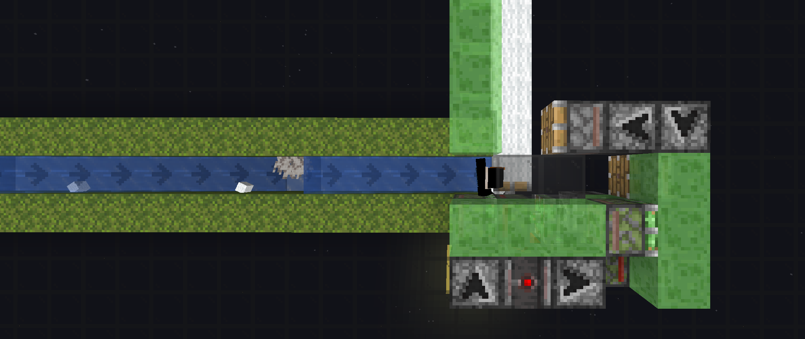
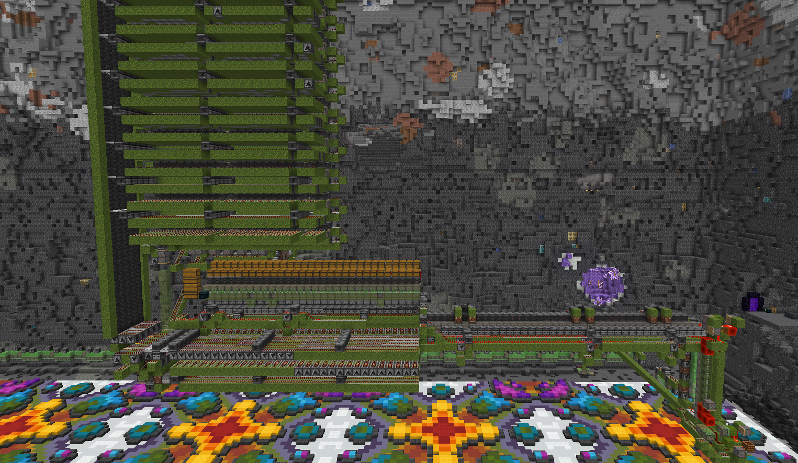
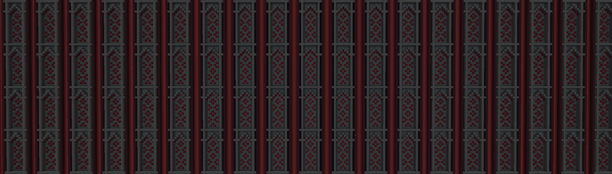
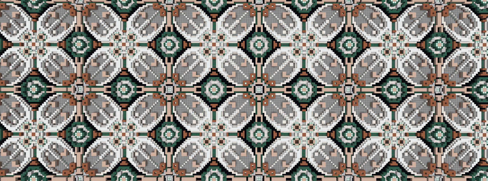
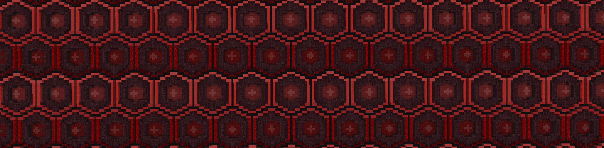

# **О способах автоматизации построек в майнкрафте**

----
## **Установка пола из одного типа блоков**
**Для автоматической установки пола используются механизмы под названием Floor Placer.**

Они позволяют толкать установленные игроком блоки поршнями дальше чем на 12 блоков, при этом передвигаясь вбок, "печатая" блоками на своём пути.

Подобные механизмы отличаются внешне, но работают на схожем принципе. Скачав схематику вам будет небходимо понять на личном опыте как ей пользоваться, а так же удлиннить до необходимого размера как описано в [гайде.]()

Способы доставки предметов игроку включают в себя - дорожки из мха и льда с водой, лёд, шедоу предметы

### **СЛЕДИТЕ ЧТОБЫ ВО ВРЕМЯ РАБОТЫ ВСЯ ТЕРРИТОРИЯ БЫЛА ПРОГРУЖЕНА**
**Для этого можно посадить ботов или игроков в вагонетки перед машинкой, чтобы те двигались с ней, либо прогружать всю территорию одновременно**

Так же существуют установщики, в которых территория готовится заранее, блоки доставляются конвейером, а игрок при этом стоит АФК в одном месте, рядом со складом материалов - такие обычно используются вместе с принтерами, о которых речь пойдет позже. 

**Наиболее часто такие механизмы включаются ломанием редстоун блока где-то в первом модуле**

----
## **Установка стен из одного типа блоков**
**Для автоматической установки стен используются механизмы под названием Wall Placer.**

Работают по похожему принципу, но двигаются вертикально. В отличие от установщика плов обычно включают в себя угловые модули, перенаправляющие поток блоков

Удлиннение и использование углов вы так же можете посмотреть в [гайде.]()
Данные механизмы позволяют достаточно быстро строить стены. Так же могут быть использованы вместе с генераторами градиента, так как игрок находится в одном месте и перемещается только по вертикали, облегчая доставку предметов

Стоит заметить, что существуют и стационарные машинки, позволяющие совсем не двигать игрока, они так же чаще исползуются с принтерами

### **СЛЕДИТЕ ЧТОБЫ ВО ВРЕМЯ РАБОТЫ ВСЯ ТЕРРИТОРИЯ БЫЛА ПРОГРУЖЕНА**
**В отличие от устаноки пола, здесь абсолютно весь путь машинки должен быть прогружен, ведь выход блоков в непрогруженные чанки просто сломает механизм**

Для запуска механизма из конца статьи поставьте игрока как показано на скриншоте и установите верхний наблюдатель

После этого начните установку блоков.

----
## **Принтеры**
### **Принтеры - это механизмы, позволяющие хранить в памяти последовательность блоков для выдачи игроку, при помощи чего можно автоматизировать повторяющиеся паттерны пола и стен**

Подобные механизмы можно условно поделить на два вида:
- Паттерн принтеры
- Градиент принтеры

**Паттерн принтеры**

Сложные машины, гененрируемые программой, позволяют автоматизировать повтоящиеся паттерны до 32 блоков шириной в один и более слоёв.

Для создания механизма, вам потребуется одна "плитка" вашего паттерна и программа, которую вы можете найти в видео ниже

Более подробный гайд по непосредственно по такому виду принтеров вы можете найти на канале [cubicmetre](https://www.youtube.com/watch?v=LvGxoUgpo00)

<iframe 
  width="500" 
  height="300" 
  src="https://www.youtube.com/embed/LvGxoUgpo00" 
  title="YouTube video player"
  frameborder="0"
  allow="accelerometer; autoplay; clipboard-write; encrypted-media; gyroscope; picture-in-picture" 
  allowfullscreen>
</iframe>
----
## **Градиент принтеры**
**Относительно простые механизмы для печати градиентов либо других паттернов, которые могут быть рассчитаны в реальном времени**

----
## **Ссылки на скачивание**
**[Floor placer - установщик пола](../Amethyst/media/4gt_Floor_glowsquid.litematic)**

**[Printer placer - установщик пола без смещения игрока](media/DIRECTIONAL%20FLOOR%20PLACER%20DO%20NOT%20ROTATE%20(800x528).litematic)**

**[Wall placer - установщик стен](../Amethyst/media/WallPlacer.litematic)**

