# **Всё о периметрах**
Все ссылки на скачивание механизмов внизу страницы

----
## **Периметр - искуственно созданная очищенная от блоков и мобов область глубиной до бедрока (-60 или 4 высоты в аду) используемая для повышения поизводительности ферм или построек**
----
## **Периметры выкапывают по нескольким причинам:**
### **- Увеличение спавнрейта мобов**
 При расположении фермы ниже, шанс на каждую попытку спавна увеличивается. При расположении платформы на высоте в 64 блока над пустотой, шанс на выбор существующей позиции в колонке блоков будет ~1/64, так как игра выбирает между нулем (-64) и самым высоким блоком в колонне. При расположении фермы на высоте 0 (-64) шанс выбора валидного спавна будет 1/2, что в 32 раза больше.
### **- Исключение лишних спавнов вне фермы**
 Так как фермы распологают низко (предыдущий пункт), периметр позволяет убрать все доступные для спавна мобов блоки в радиусе >128 блоков от игрока.
### **- Уменьшение лага**
 Избавляясь от лишних блоков в радиусе прорузки, мы не загружаем их в память и не обрабатываем каждый тик. А именно - сундуки, трава, растущий тостник, спавн и ИИ нейтральных мобов и ТД.
### **- Декорации**
 Позволяет разрабатывать и строить любые декорации для ферм, не зависимо от высоты и расположения в мире

----
## **Способы создания периметра**
### **- World Eater**
 Использует Тренчеры (Trencher) для выкапывания боковых траншей для основной машины. После запуска взрывает блоки по слоям, одновременно убирая жидкости. Позволяет наиболее эффективно автоматизировать процесс.
### **- 3-way дюперы**
 Требуют ручной уборки жидкостей и постоянного мониторинга процесса. Не рекомендуется

----
## **Как изменить размер World Eater**
### **1. Вставьте скачанную схему в креативе**
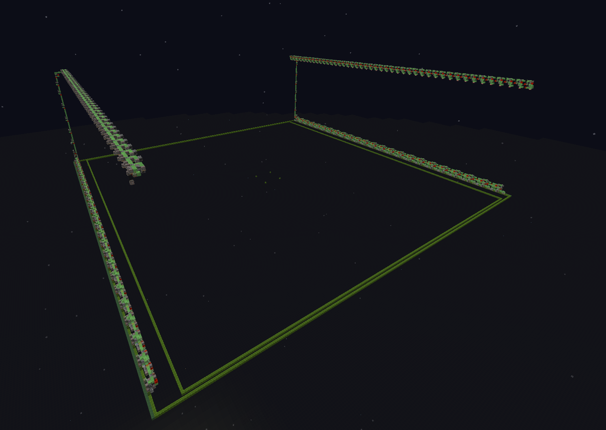
### **2. Используя инструменты лайтматки, сохраните регионы с несколькими последними машинками**
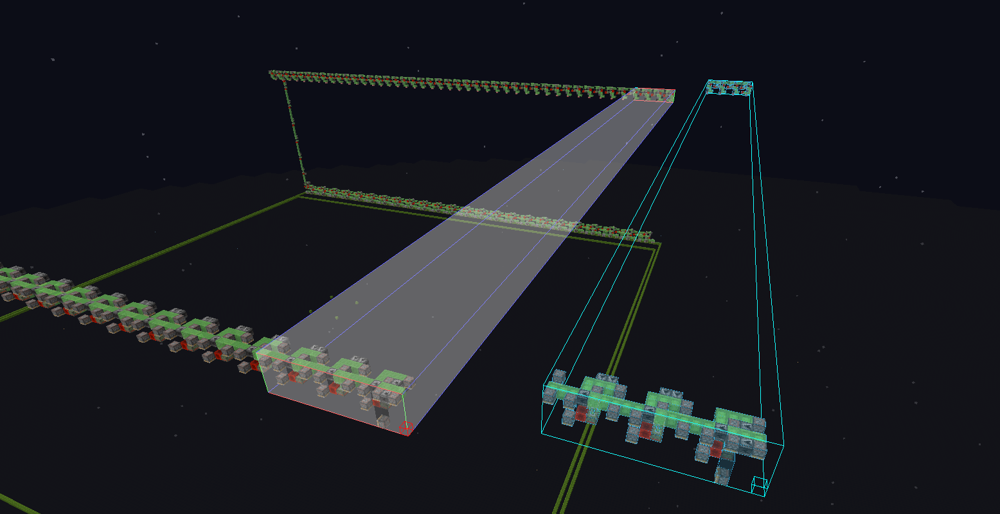
### **3. Подвиньте схематику машинок до нужного размера, следите чтобы они сошлись с обеих сторон**
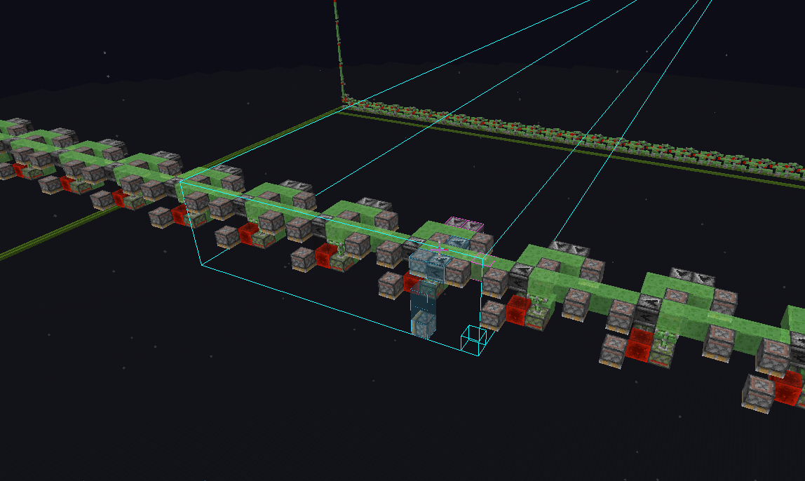
### **4. Сломайте или //set всё лишнее, потом вставьте схему**
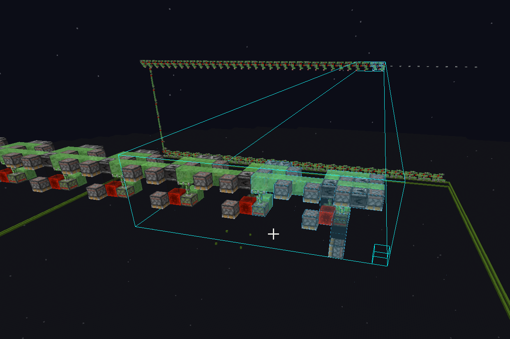
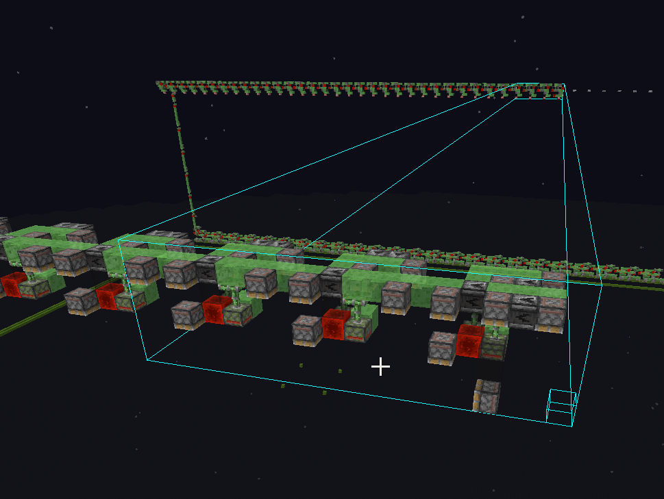
### **5. Повторите для нижней части, следите чтобы верх и низ не отличались по длинне больше чем на 2-3 блока**
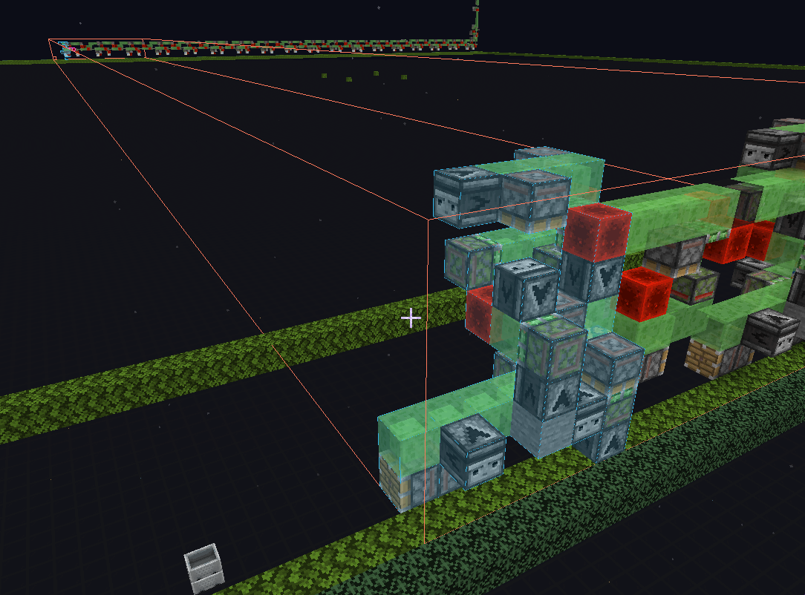
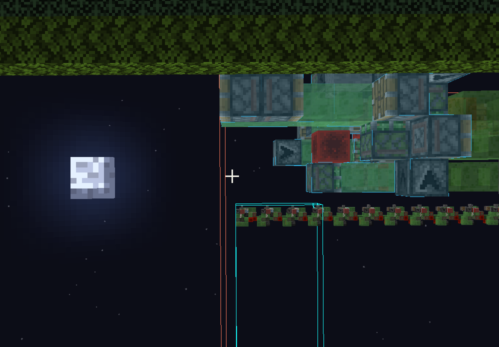
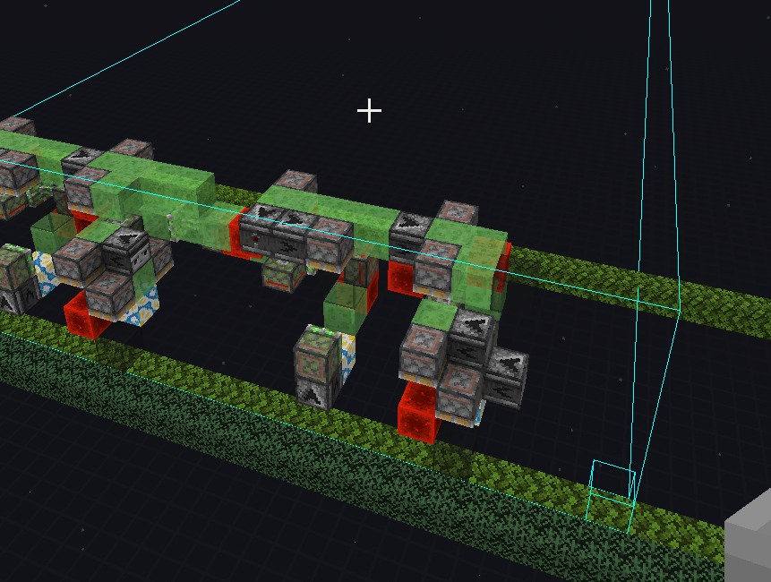
### **6. Проверьте схему на наличие лишних блоков через лайтматику**
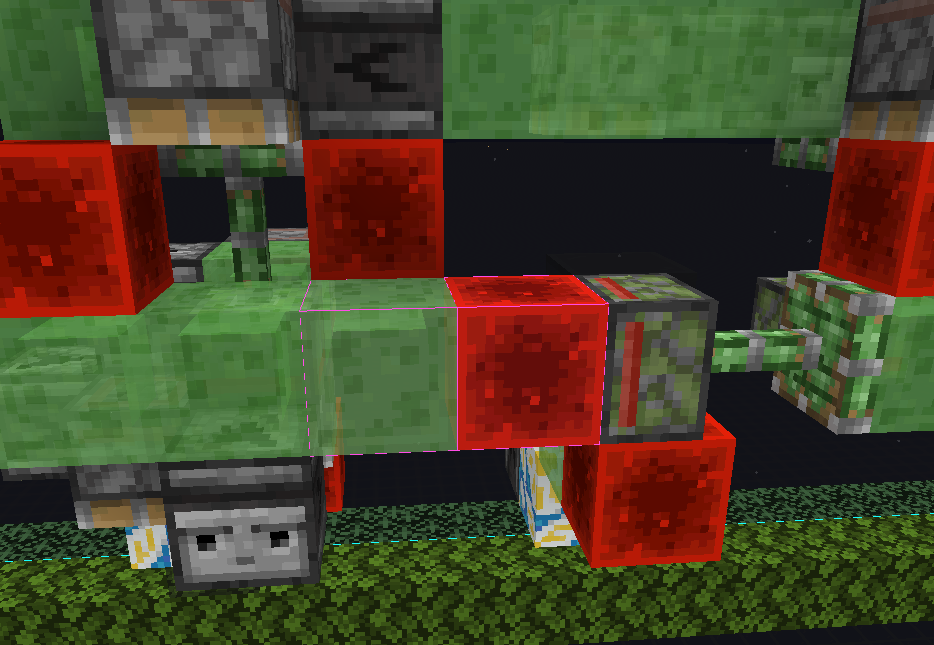
### **В ином случае у вас произойдет нечто такое:**
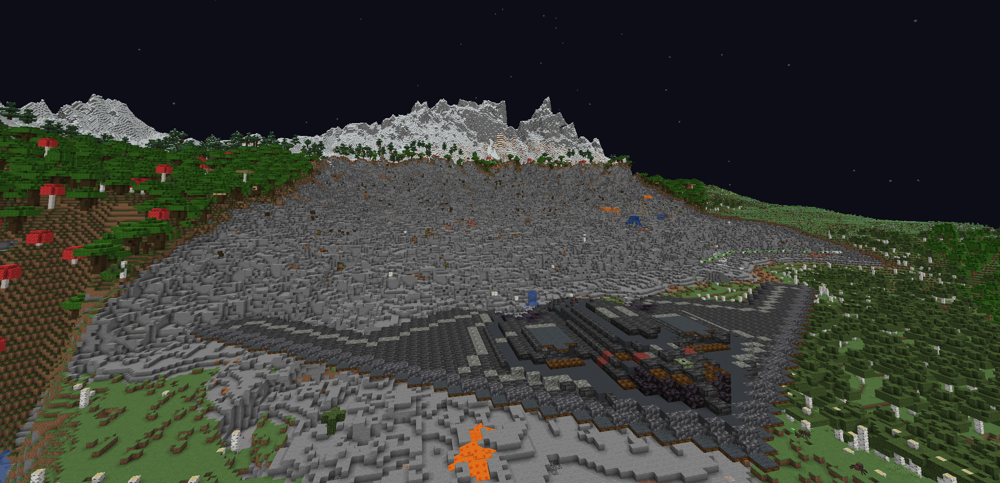

----
## **В мире**
### **Установите 13-wide tencher на широкие части траншеи.** 
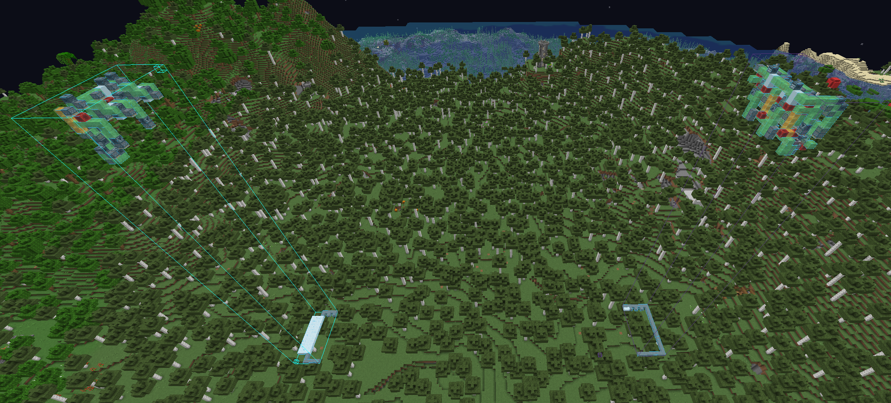

Используйте схему World Eater выровнянную по территрии и расчистите колонну блоков до бедрока под разметкой из белой шерсти
### **Вы так же можете использовать 12-wide тренчер**
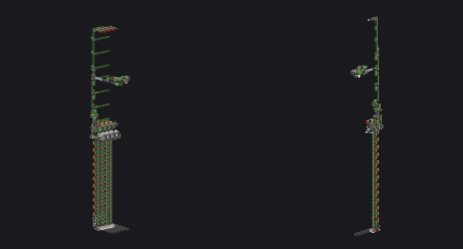

### **Боковые траншеи можно выкопать используя 3-wide тренчеры**
Процесс можете увидеть в [видео](https://youtu.be/DzmUeYRyVLw?si=AYKRYzccRE8IXLe4){:target="_blank"} на канале

### **После готовых трашней, можно строить и сам World Eater**

Если что-то не понятно - перед тем как задавать вопросы **ЗАЙДИТЕ В КРЕАТИВ И ПОТЫКАЙТЕ КАК И ЧТО РАБОТАЕТ ПО ОТДЕЛЬНОСТИ**

----
## **Ссылки на скачивание:**
**[Chronos trenchers](media/Chronos Trencher Collection.zip){:target="_blank"}**

**[13 wide](media/6gt_trencher_13_wide_1.18_weather_proof.litematic){:target="_blank"}**

**[528 World Eater](media/528SmallTrenchWorldEater.litematic){:target="_blank"}**

**[272 World Eater](media/272SmallTrenchWorldEater.litematic){:target="_blank"}**

**[3-way Downaccel Дюпер](media/3-way_downaccel.litematic){:target="_blank"}**

----