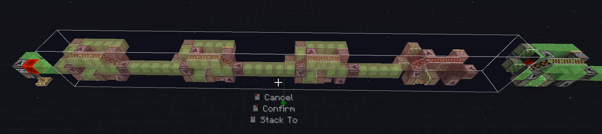
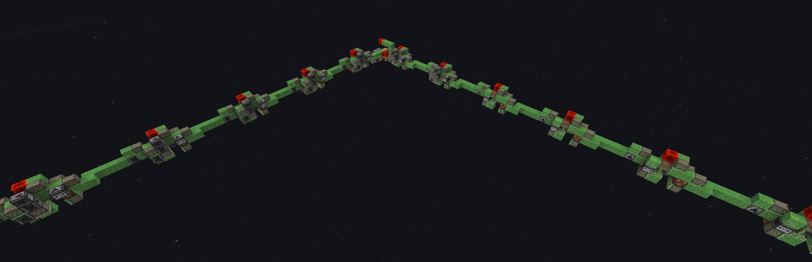
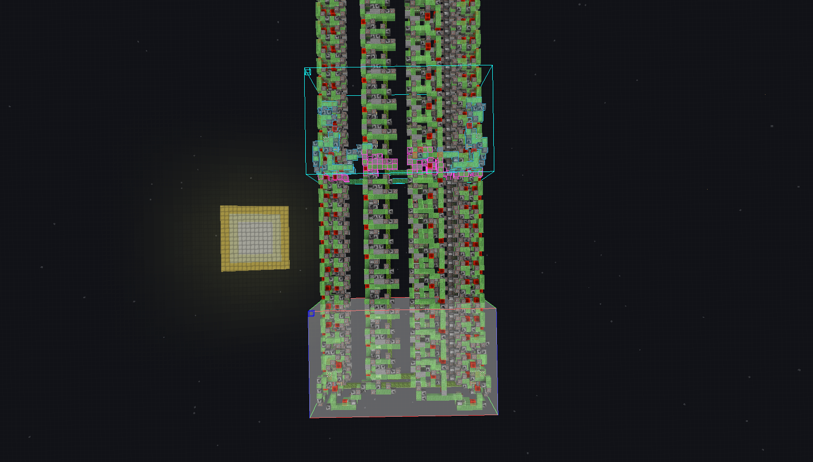

# **Об изменении размеров слаймстоун построек**

----
## **Основные правила**
### **Для изменения размеров большинства механизмов на блоках слизи существуют два основных шага:**
- Найти повторяющиеся элементы (модули) в постройке
- Изменить размер механизма повторением или удалением лишних модулей

### **Пример основан на изменении размера установщика пола. После описаны индивидуальные ситуации для других механизмов**

Вы можете использовать гиперссылки для перехода к необходимой вам постройке, однако рекомендуется прочитать всё:
- [Установщик пола](#любой-простой-слаймстоун-механизм-состоит-из-максимум-трёх-частей)
- [Установщик стен](#для-установки-стен-процедура-немного-отличается-в-ситуации-когда-вам-необходимо-использовать-угловые-элементы-для-поворотов)
- [World Eater](#изменение-размеров-механизмов-таких-как-world-eater-немного-отличается-и-требует-особенного-внимания)
- [Nether World Eater](#для-world-eater-в-незере)

----
### **Любой простой слаймстоун механизм состоит из максимум трёх частей.**
На изображении выше представлен установщик пола, разделенный по регионам на три части

Три части этого механизма включают в себя слева на право:
- Stopper (Остановщик)
- Основная часть
- Начальный модуль (Там, где игрок ставит блоки)

Насколько мы видим, именно основная часть имеет поворяющиеся элементы

Каждый из основных модулей именно этой постойки имеет длину в 11 блоков

Таким образом, мы можем сдвинуть остановщик в сторону на ближайшее к требуемой длине количество блоков кратное 11 (11, 22, 33, 44 и тд)

После этого возьмите один из модулей и повторите его нужное количество раз

Для уменьшения размера вы можете наоборот, вырезать повторяющиеся элементы и сдвинуть оставшееся

Вы так же можете менять размер и форму остановщика для точной настройки ширины платформы.

**Некоторые механизмы не имеют остановщика вовсе, тогда блоки двигаются на 11 блоков дальше последней машинки и упираются в лимит поршней.**

----

### **Для установки стен процедура немного отличается в ситуации, когда вам необходимо использовать угловые элементы для поворотов.**

**В таком случае вы можете следовать этим инструкциям:**

Найдите регионы с повторяющимися модулями

Удлинните используя уже полученные выше в статье методы

После этого скопируйте угловой элемент **ВМЕСТЕ** с двумя окружающими модулями

Поверните его и вставьте в конец, выровняв по последнему модулю

Вы можете использовать лайтматику, мод покажет ошибки, если схема расположена не правильно:

После этого вставьте следующую линию из модулей

**Повторите ещё нужное количество раз пока не получите все 4 стены, если необходимо. Если нужна лишь одна стена - игнорируйте угловые части и просто используйте метод из раздела про установщики пола**

Не забудьте вернуть в конец **остановщик**, либо как в этом случае - набор из трёх расположенных рядом модулей

Поздравляю, у вас теперь есть стена

----

### **Изменение размеров механизмов таких как World Eater немного отличается и требует особенного внимания**

Связано это с тем, что верх и низ схемы зачастую имеют разный период повторения модулей. В конце статьи вы сможете найти информацию для World Eater для незера.

**Простой способ для уменьшения:**
Вы можете взять схему последних машинок сразу и для верхней и для нижней части.

И двигать её до тех пор, пока лайтматика не перестанет ругаться одновременно и на низ и на верх постройки

Как вы видите на последнем скриншоте, обе части (верх и низ) совпадают, а лишние блоки мы уберем

После этого вставим нашу схему

----

### **Универсальный способ:**

Возьмите отдельно схему нижней части

Если вам нужно укоротить схему, сдвиньте до ближайшего к искомому размеру совпадения

Удалите лишнее и вставьте

Возьмите схему крайних модулей сверху

Соотнесите схему так, чтобы динамит крайней будущей машинки был не дальше 4 блоков в бок от листвы

А так же, чтобы крайняя машинка не выходила в бок за границы из листвы

Уберите лишнее и вставьте схему

**Расположение как динамита так и края машинки может быть разным, главное следить чтобы они не выходили за указанные ранее пределы. В ином случае возможно вам придется делать одну из боковых траншей шире, чтобы достать ей до дистанции в 4 блока от динамита**

### **ЕСЛИ ВАМ НУЖНО НАОБОРОТ УВЕЛИЧИТЬ РАЗМЕР**

Используйте информацию из начала статьи, а именно раздела про Floor Placer - для верха и низа World Eater отдельно:
1. Найти повторение в схеме
2. Удлинить повторяющуюся часть
3. Вернуть на место элементы по краям

Всегда практикуйтесь и проверяйте постройки в креатив мире, прежде чем строить их в выживании

----
## **Для World Eater в незере**
Для таких механизмов намного проще подобрать соответствие используя [простой](#изменение-размеров-механизмов-таких-как-world-eater-немного-отличается-и-требует-особенного-внимания) метод

----
## **Ссылки на скачивание:**

**[Floor placer - установщик пола](../Amethyst/media/4gt_Floor_glowsquid.litematic)**

**[Wall placer - установщик стен](../Amethyst/media/WallPlacer.litematic)**

**[528 World Eater](../Perimeters/media/528SmallTrenchWorldEater.litematic){:target="_blank"}**

**[272 World Eater](../Perimeters/media/272SmallTrenchWorldEater.litematic){:target="_blank"}**

**[270 Nether World Eater](media/270_14m_afk_debris_world_eater.litematic){:target="_blank"}**

----